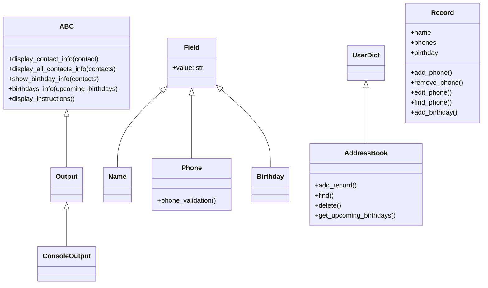

```mermaid
classDiagram
    ABC <|-- Output
    Output <|-- ConsoleOutput
    Field <|-- Name
    Field <|-- Phone
    Field <|-- Birthday
    Record
    UserDict <| -- AddressBook
    class ABC {
        +display_contact_info(contact)
        +display_all_contacts_info(contacts)
        +show_birthday_info(contacts)
        +birthdays_info(upcoming_birthdays)
        +display_instructions()
    }
    class Field{
        +value: str
    }
    class Phone{
        +phone_validation()
    }
    class Record{
        +name
        +phones
        +birthday
        +add_phone()
        +remove_phone()
        +edit_phone()
        +find_phone()
        +add_birthday()

    }
    class AddressBook{
        +add_record()
        +find()
        +delete()
        +get_upcoming_birthdays()
    }

```